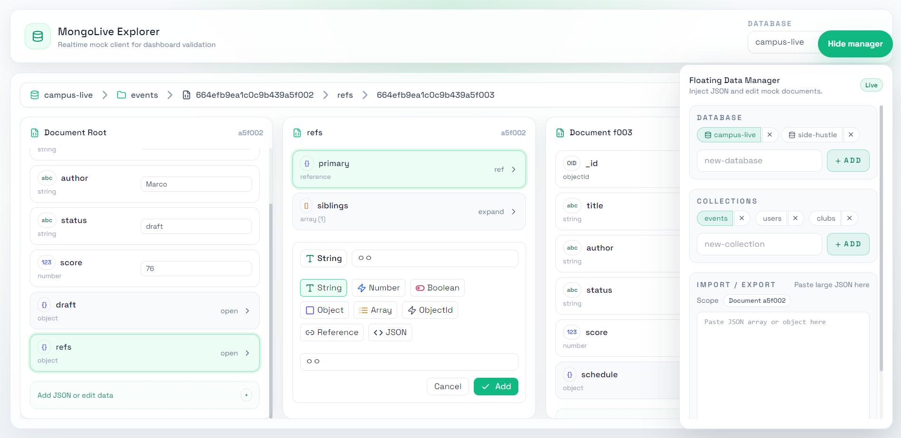
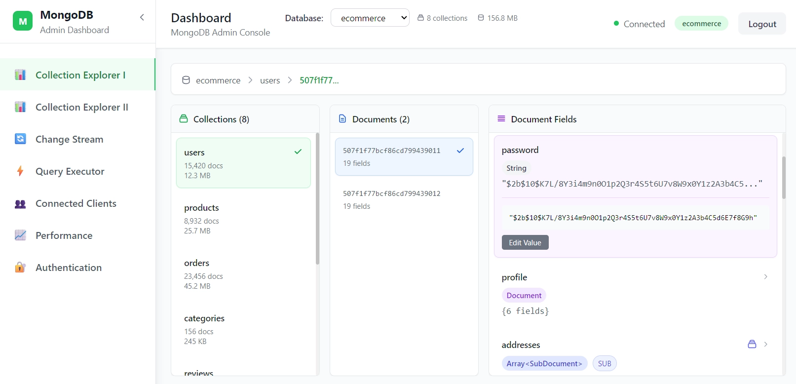
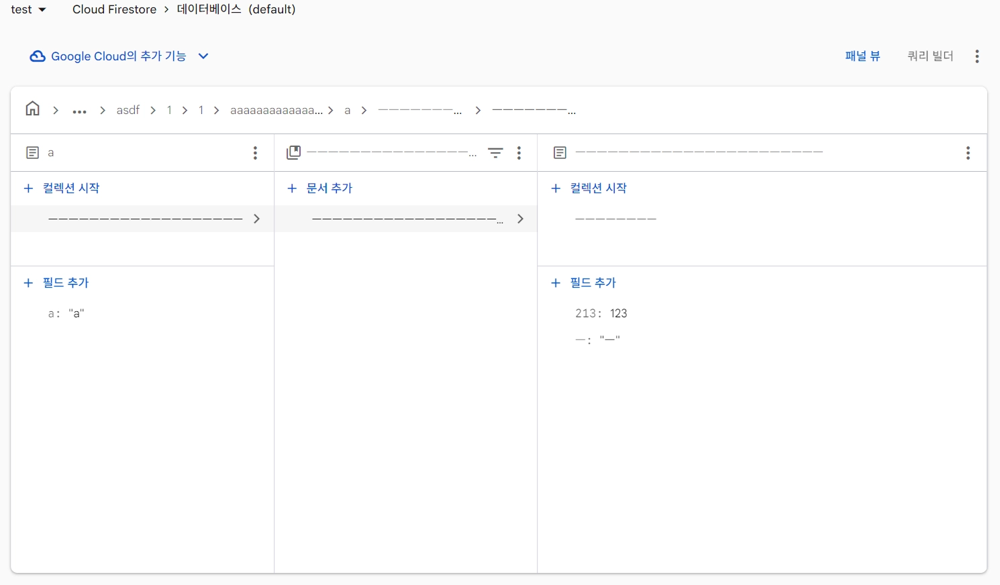

<!-- Project README: Json_explorer -->
### -> https://jsb0315.github.io/Json_explorer/

# JSON Explorer & Editor
## Miller Column interface · Inline editing · Reference-aware navigation

<aside>
💡

**MongoDB Live Dashboard**

1년전 프로토타입

FireStore 패널 뷰

하고싶은거:
https://github.com/jsb0315/Mongolive_legacy 리뉴얼
    
- REF: [MongoDB Compass](https://www.mongodb.com/ko-kr/products/tools/compass), [Google Firestore 패널 뷰](https://firebase.google.com/docs/firestore/using-console?hl=ko)
</aside>

실제 API 연동 전 프론트엔드 - 백엔드 공유 타입 기반으로 더미 JSON 데이터를 구성  
UI/UX 및 상태 관리를 선제적으로 유닛 테스트

<aside>
💡

**환경**

- **AI**
    - **구글 제미나이 3.1 Pro Extended (아끼면서)**
    - **Copilot Pro - GPT-5.2-Codex**
- **개발**
    - **React 18, Vite**
    - **TypeScript**
    - **TailwindCSS, Lucide-react**
</aside>